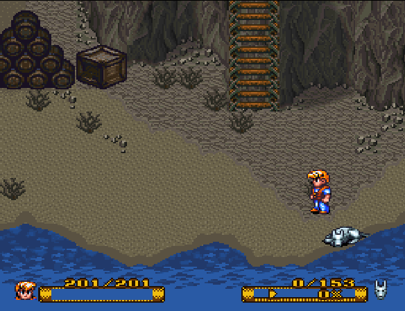
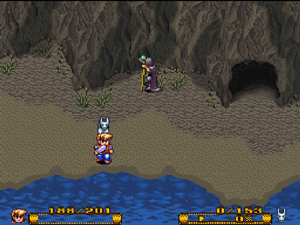
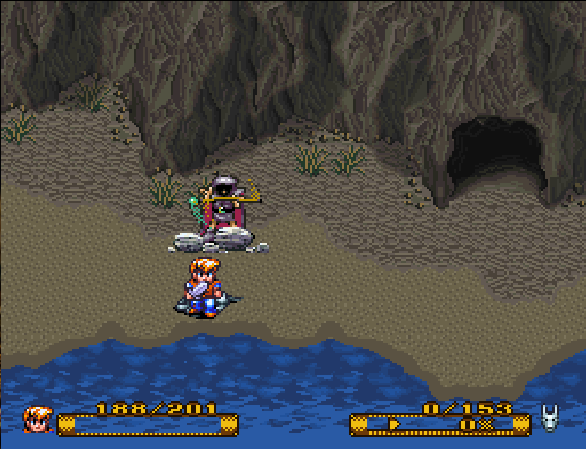

# secret_of_evermore_trainer

| Branch    |            
|-----------|-------------------------------------------------------------------------------------------------------------------------------------------
| `master`  |     
| `develop` |    

xdotool trainer for Secret of Evermore

## `train_attack_spell_crustacia.sh`

Stand here, have an offensive spell (e.g. Crush, Flare, Sting) selected.

The player will move to the right and go the next screen.
It will move down and cast a spell.

After the spell, the player moves left again, back to the first screen.
